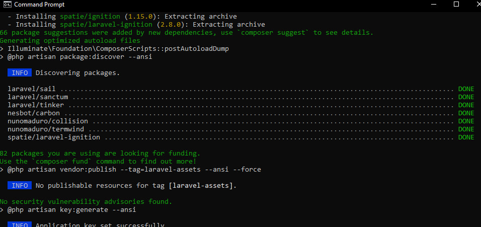
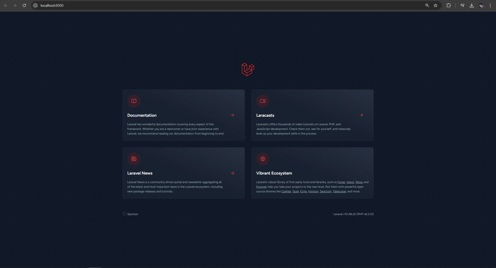
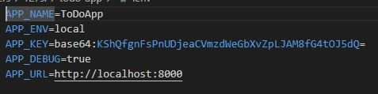
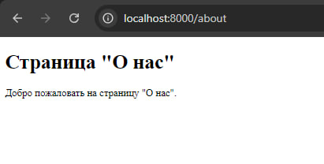
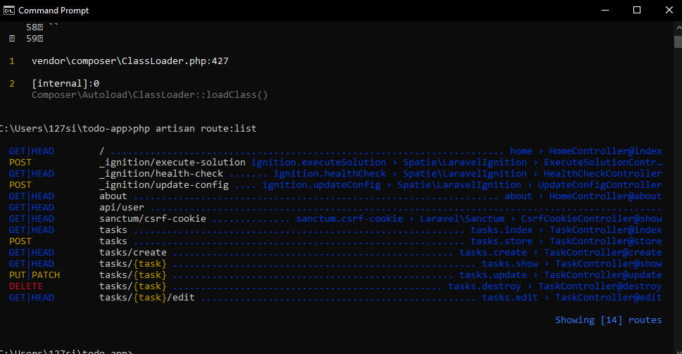
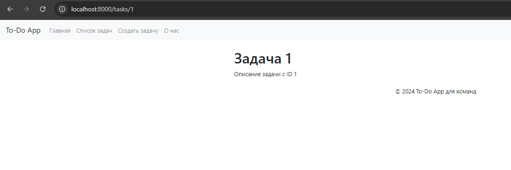
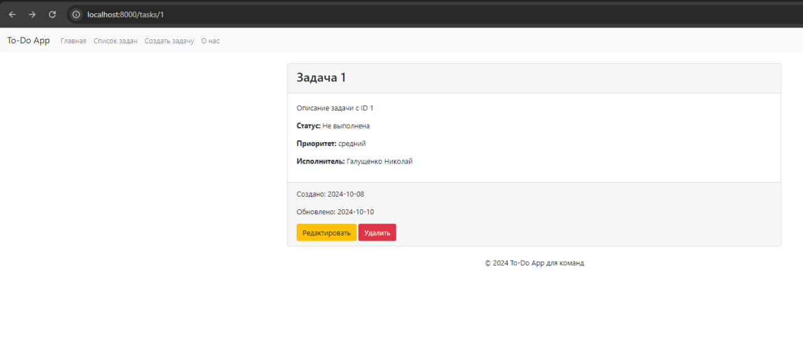
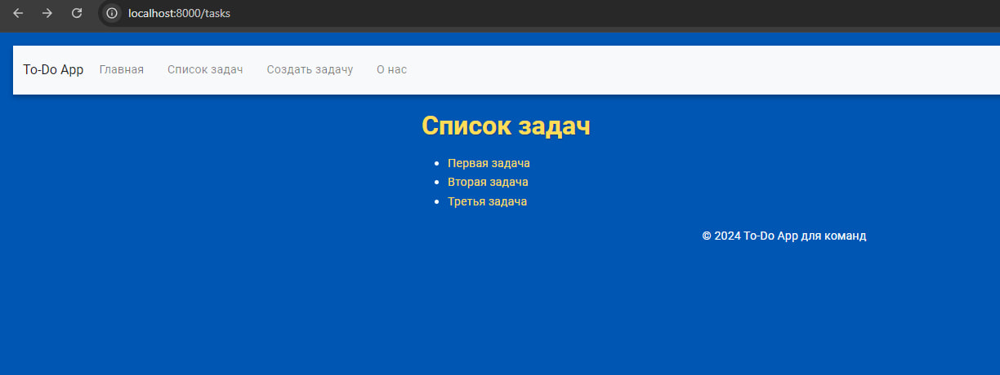

# Отчет по лабораторной работе: Создание To-Do App для команд на Laravel
(Сам проект находится в ветке todo-app)


### Шаг 1: Установка и настройка Laravel

Вначале я установил Laravel с помощью Composer и настроил среду разработки:
- Создал новый проект с помощью команды:
  
    ```bash
    composer create-project laravel/laravel todo-app
    ```

- Настроил конфигурационный файл `.env` и сгенерировал ключ приложения с помощью команды `php artisan key:generate`.

- Запустил локальный сервер для проверки начального состояния приложения.


### Вопрос: Что вы видите в браузере, открыв страницу http://localhost:8000?



### Шаг 2: Настройка окружения

- Открыл файл `.env` и указал следующие настройки приложения:

    ```ini
    APP_NAME=ToDoApp
    APP_ENV=local
    APP_KEY=
    APP_DEBUG=true
    APP_URL=http://localhost:8000
    ```

- Сгенерировал ключ приложения, который будет использоваться для шифрования данных:

    ```bash
    php artisan key:generate
    ```

    

### Вопрос: Что будет, если данный ключ попадет в руки злоумышленника?
- Злоумышленник сможет расшифровать конфиденциальные данные, хранящиеся в зашифрованном виде (например, сессии пользователей и другие данные, защищенные этим ключом).


### Шаг 3: Создание контроллеров и маршрутов

Для реализации функционала управления задачами я создал контроллеры и маршруты:
- Создал контроллер `HomeController` для главной страницы и страницы "О нас".
- Создал контроллер `TaskController`, в котором определил методы для отображения списка задач, создания новой задачи, редактирования и удаления задач.
- Определил маршруты для этих контроллеров в файле `routes/web.php`, используя ресурсный контроллер для `TaskController`.



### Вопрос:Объясните разницу между ручным созданием маршрутов и использованием ресурсного контроллера. Какие маршруты и имена маршрутов будут созданы автоматически?

- Разница между ручным созданием маршрутов и использованием ресурсного контроллера:

Ручное создание маршрутов: Каждый маршрут нужно объявлять отдельно в файле маршрутов (например, web.php). Это требует больше кода и может привести к ошибкам при добавлении новых маршрутов.

Использование ресурсного контроллера: Позволяет автоматически создать набор стандартных маршрутов для CRUD-операций с помощью одной команды. Это упрощает и упорядочивает код.




### Шаг 4: Шаблонизация с использованием Blade

Для удобства работы с шаблонами я:
- Создал главный макет приложения в файле `layouts/app.blade.php`, куда вынес общие элементы страницы, такие как навигация и футер.
- Использовал директиву `@yield` для вставки контента различных страниц в макет.
- Создал отдельные представления для отображения списка задач (`tasks/index.blade.php`) и страницы с детальной информацией о задаче (`tasks/show.blade.php`).



### Шаг 4: Использование компонентов Blade

Чтобы сократить дублирование кода и сделать проект более гибким:
- Создал анонимный компонент `header`, который отвечает за отображение навигационного меню.
- Создал компонент для отображения задачи в файле `components/task.blade.php`, который принимает параметры, такие как заголовок, описание, статус, приоритет и исполнитель задачи.
- Подключил компонент задачи к представлению `show.blade.php` для отображения детальной информации о задаче.



### Шаг 5: Стилизация приложения

Для улучшения внешнего вида приложения я создал файл стилей `app.css`:
- Подключил Google-шрифт `Roboto` и увеличил общий размер шрифта для лучшей читаемости.
- Сделал синий фон для страницы и белый текст, чтобы сделать интерфейс контрастным.
- Использовал стили для карточек, кнопок и заголовков, добавив тени и эффекты при наведении, чтобы улучшить взаимодействие с интерфейсом.
- Стили задействованы во всех элементах приложения, включая карточки задач, заголовки и навигацию.




## Вопросы и ответы

1. **Что вы видите в браузере, открыв страницу http://localhost:8000?**
   - При открытии страницы я вижу стандартную стартовую страницу Laravel с информацией о документации и экосистеме.

2. **Что будет, если ключ приложения попадет в руки злоумышленника?**
   - Злоумышленник сможет расшифровать конфиденциальные данные, хранящиеся в зашифрованном виде (например, сессии пользователей и другие данные, защищенные этим ключом).

3. **Объясните разницу между ручным созданием маршрутов и использованием ресурсного контроллера. Какие маршруты и имена маршрутов будут созданы автоматически?**
   - Ручное создание маршрутов требует отдельного объявления каждого маршрута, тогда как ресурсный контроллер автоматически создаёт маршруты для всех CRUD-операций (index, create, store, show, edit, update, destroy). Примеры автоматически созданных маршрутов:
     - `tasks.index` — для списка задач.
     - `tasks.create` — для отображения формы создания задачи.
     - `tasks.store` — для сохранения новой задачи.
     - `tasks.show` — для отображения конкретной задачи.
     - `tasks.edit` — для редактирования задачи.
     - `tasks.update` — для обновления задачи.
     - `tasks.destroy` — для удаления задачи.

4. **Что произойдёт, если не передать переменную `$id` в компонент Blade?**
   - Возникнет ошибка `Undefined variable: $id`, так как компонент не получит необходимый параметр для корректного отображения информации и ссылок на редактирование или удаление задачи.


